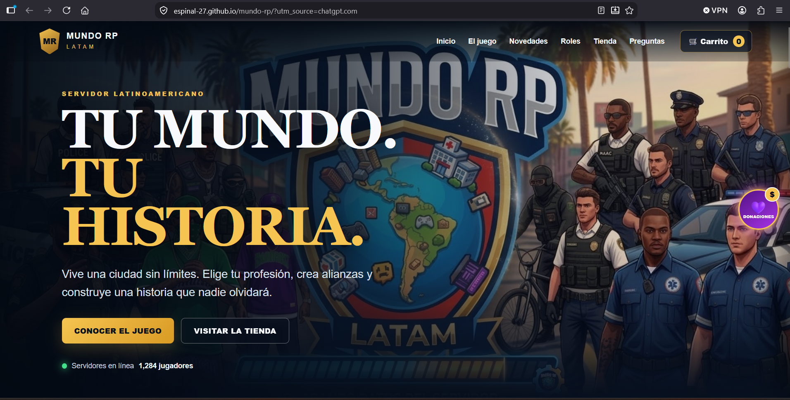

# Mundo RP

Página web desarrollada para el proyecto Mundo RP.

## Demo
  
  [Ver página web](https://espinal-27.github.io/mundo-rp/)
  
  ## Vista previa



## Descripción

Mundo RP es una página web desarrollada como proyecto para presentar información relacionada con un servidor de RolePlay.

El proyecto busca ofrecer una interfaz sencilla, visual y fácil de navegar para los usuarios.

## Tecnologías utilizadas

- HTML5
- CSS3
- JavaScript

## Características

- Diseño web personalizado
- Navegación entre las diferentes secciones
- Uso de imágenes y recursos visuales
- Interactividad mediante JavaScript
- Diseño adaptable a diferentes tamaños de pantalla

## Estructura del proyecto

```text
mundo-rp/
│
├── imagenes/
├── index.html
├── script.js
├── style.css    
└── README.md  
